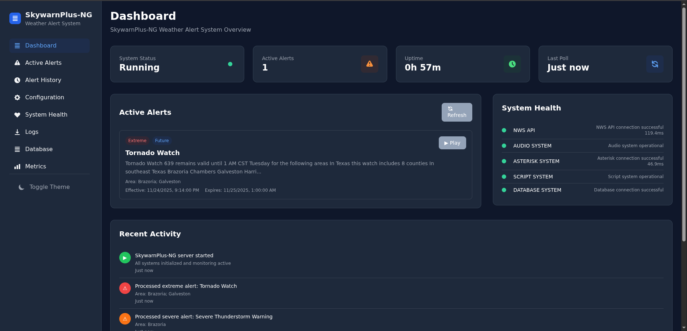
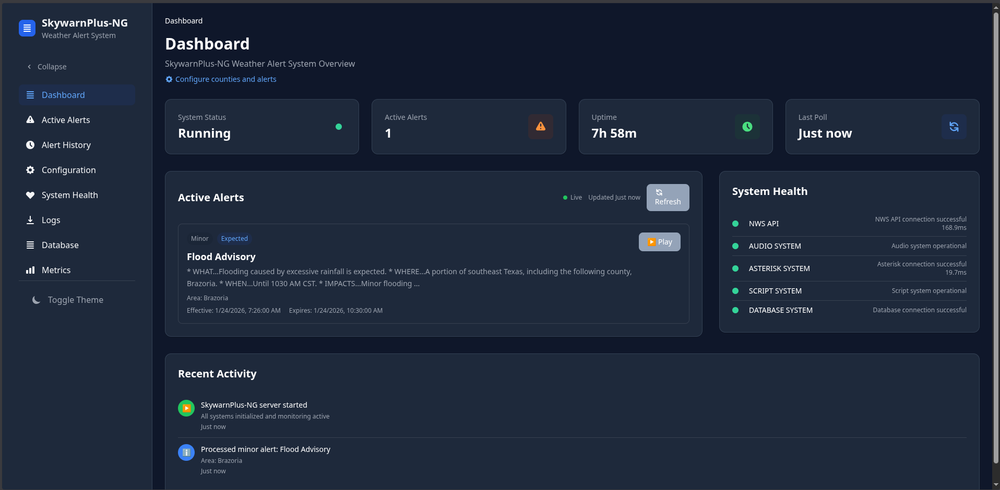

# SkywarnPlus-NG

Modern weather alert system for Asterisk/app_rpt nodes with DTMF integration.

<p align="center">
  <a href="SkywarnPlus-ng.png"></a>
  <a href="SkywarnPlus-ng-1.png"></a>
</p>

*Click the thumbnails above to view full-size dashboard screenshots*

## About

SkywarnPlus-NG is a complete rewrite of the original [SkywarnPlus](https://github.com/Mason10198/SkywarnPlus) project by [Mason Nelson (N5LSN/WRKF394)](https://github.com/Mason10198). This rewrite modernizes the codebase, adds a web dashboard, and improves maintainability while preserving the core concept and functionality of the original project. We extend our gratitude to Mason Nelson for the original idea and implementation that inspired this project.

## Quick Start

```bash
# Download the signed release tarball
wget https://github.com/hardenedpenguin/SkywarnPlus-NG/releases/download/v1.0.4/skywarnplus-ng-1.0.4.tar.gz

# Extract and run the installer (will prompt for sudo where required)
tar -xzf skywarnplus-ng-1.0.4.tar.gz
cd skywarnplus-ng-1.0.4
./install.sh

# Enable and start the service
sudo systemctl enable skywarnplus-ng
sudo systemctl start skywarnplus-ng

# Access the web dashboard to configure your installation
# Default credentials: admin / skywarn123
# Navigate to the Configuration tab to set up counties, alerts, and other settings
http://localhost:8100
```

> **Note:** After installation, start the service and configure SkywarnPlus-NG through the web interface. The dashboard provides a user-friendly way to configure all settings including counties, audio options, notifications, and DTMF commands without editing YAML files manually.
>
> **Firewall:** If accessing the web dashboard from a remote machine, ensure port 8100 is open in your firewall. For example, with `ufw`: `sudo ufw allow 8100/tcp`

> **Heads up:** The installer targets Debian 13 (trixie) and Python 3.13. On other distros ensure the prerequisites listed below are installed before running the script.

## Requirements

- 64-bit Linux host (Debian 13 recommended)
- Python 3.13 with `python3-venv`, `python3-dev`
- GCC toolchain (`build-essential` or `gcc g++`)
- System dependencies: `ffmpeg`, `sox`, `libsndfile1`, `libopenblas0`, `libgomp1`, `libffi-dev`, `libssl-dev`, `libasound2-dev`, `portaudio19-dev`
- Optional: Asterisk/app_rpt node for on-air playback
- Outbound Internet access (NWS API, optional gTTS/Pushover)

All of the above are installed automatically when you run `install.sh` on a clean Debian 13 system. For other distributions install the equivalents using your package manager before running the installer.

## Installation Steps

1. **Download & Verify**
```bash
   wget https://github.com/hardenedpenguin/SkywarnPlus-NG/releases/download/v1.0.4/skywarnplus-ng-1.0.4.tar.gz
   sha256sum skywarnplus-ng-1.0.4.tar.gz
   ```
   Compare the checksum against the value published on the release page.

2. **Extract & Install**
```bash
   tar -xzf skywarnplus-ng-1.0.4.tar.gz
   cd skywarnplus-ng-1.0.4
   ./install.sh
   ```
   The installer creates the service account, virtualenv, systemd unit, logrotate config, and copies sounds/scripts.

3. **Start the Service**
   ```bash
   sudo systemctl enable skywarnplus-ng
   sudo systemctl start skywarnplus-ng
   sudo systemctl status skywarnplus-ng
   ```

4. **Configure via Web Interface**
   - **Firewall:** If accessing remotely, ensure port 8100 is open in your firewall (e.g., `sudo ufw allow 8100/tcp`)
   - Visit the web dashboard at `http://<hostname>:8100` (or behind your reverse proxy)
   - Default login: `admin / skywarn123`
   - Navigate to the **Configuration** tab to configure:
     - County codes to monitor
     - Asterisk node numbers (optional)
     - TTS engine settings (gTTS or Piper)
     - Alert notifications (Email, Pushover, Webhook)
     - DTMF command settings
     - All other application settings
   
   > All configuration changes made through the web interface are automatically saved to `/etc/skywarnplus-ng/config.yaml`. You can also edit the YAML file directly if preferred, but the web interface provides a user-friendly alternative.

5. **Reverse Proxy (optional)**
   When fronting with Apache/Nginx under `/skywarnplus-ng`, set `monitoring.http_server.base_path: "/skywarnplus-ng"` in `config.yaml`, ensure static assets are proxied, and forward WebSocket upgrades to `/ws`. [Nginx Proxy Manager](nginx-proxy-manager-guide.md)

## Configuration

Configuration is managed through the web dashboard, which provides an intuitive interface for all settings. All changes made through the web interface are automatically saved to `/etc/skywarnplus-ng/config.yaml`.

**To configure via web dashboard:**
1. Start the service: `sudo systemctl start skywarnplus-ng`
2. Ensure port 8100 is open in your firewall (e.g., `sudo ufw allow 8100/tcp` for remote access)
3. Access the dashboard: `http://<hostname>:8100`
4. Log in with default credentials: `admin / skywarn123`
5. Navigate to the **Configuration** tab to configure all settings

## Features

- **Weather Alerts**: Real-time NWS alert monitoring and voice announcements
- **SkyDescribe DTMF**: On-demand weather descriptions for active alerts via DTMF codes (*1, *2, *3, etc.)
- **Web Dashboard**: Modern, responsive web interface with:
  - Two-level configuration tabs for better organization
  - Collapsible sidebar (desktop)
  - Search, sort, and pagination on alerts
  - Live WebSocket connection indicator
  - Skeleton loaders and enhanced error handling
  - Mobile-optimized responsive design
- **Tail Messages**: Continuous alert announcements via tail message system
- **Courtesy Tones**: Automatic tone switching based on alert status
- **ID Changes**: Dynamic node ID switching for weather alerts
- **AlertScript**: Execute commands (BASH/DTMF) on alert detection
- **County Audio**: Play county-specific audio files in announcements
- **Notifications**: Email, Pushover, and webhook notifications for alerts

## DTMF Commands

SkyDescribe DTMF commands allow you to request weather information via DTMF codes on your Asterisk/app_rpt node. **Note: DTMF commands only describe currently active alerts** - expired or cancelled alerts are not accessible via DTMF.

The DTMF codes `841-849` are mapped to describe active alerts by index (1-9). These codes are automatically configured during installation via the `skydescribe.conf` file.

- `841` - Describe the 1st active alert (by index)
- `842` - Describe the 2nd active alert (by index)
- `843` - Describe the 3rd active alert (by index)
- `844` - Describe the 4th active alert (by index)
- `845` - Describe the 5th active alert (by index)
- `846` - Describe the 6th active alert (by index)
- `847` - Describe the 7th active alert (by index)
- `848` - Describe the 8th active alert (by index)
- `849` - Describe the 9th active alert (by index)

**Alternative:** You can also use the CLI command directly:
```bash
skywarnplus-ng describe 1                    # Describe 1st active alert
skywarnplus-ng describe "Tornado Warning"    # Describe all alerts with this title
```

> **Important:** Before using DTMF commands, ensure that:
> 1. SkywarnPlus-NG is running and monitoring your configured counties
> 2. The `skydescribe.conf` file is properly installed in `/etc/asterisk/custom/rpt/` (automatically generated during installation)
> 3. DTMF commands are enabled for your node in the Asterisk app_rpt menu system (ASL-menu)

## Service Management

```bash
sudo systemctl restart skywarnplus-ng
sudo systemctl status skywarnplus-ng
journalctl -u skywarnplus-ng -f
```

## License

MIT License - see LICENSE file for details.
