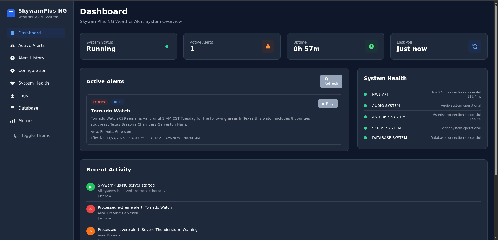
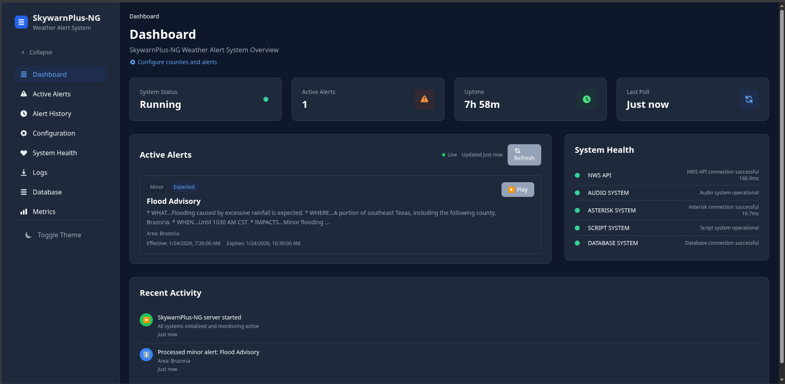

# SkywarnPlus-NG


Weather alerts for Asterisk / app_rpt nodes — voice announcements, DTMF SkyDescribe, and a web dashboard.

<p align="center">
  <a href="SkywarnPlus-ng.png"></a>
  <a href="SkywarnPlus-ng-1.png"></a>
</p>

Modern rewrite of [SkywarnPlus](https://github.com/Mason10198/SkywarnPlus) by Mason Nelson (N5LSN/WRKF394). Release notes: [GitHub Releases](https://github.com/hardenedpenguin/SkywarnPlus-NG/releases).

**Current release:** [v1.6.3](https://github.com/hardenedpenguin/SkywarnPlus-NG/releases/tag/v1.6.3)

> **Install and upgrades:** SkywarnPlus-NG is moving to the **Debian `.deb` package** for new installs and updates. Use the [hardenedpenguin APT repository](https://hardenedpenguin.github.io/hardenedpenguin-apt/) (`apt install skywarnplus-ng`) or install a `.deb` from [Releases](https://github.com/hardenedpenguin/SkywarnPlus-NG/releases). The release tarball **`install.sh`** flow is **deprecated** — it remains for legacy sites but is no longer supported. Tarball installs do not reliably deploy package-managed files (for example voice-install sudoers, systemd units, and Apache snippets). See **[docs/debian.md](docs/debian.md)**. Existing tarball installs should [migrate to apt](docs/debian.md#migrating-from-tarball-installsh-to-apt) rather than re-run `install.sh`.

## Install

**Prerequisites:** 64-bit Linux (**amd64** or **arm64**), **asl3-asterisk** with user **`asterisk`**, **asl3-tts**, outbound Internet for NWS.

### APT repository (recommended)

One-time setup adds the signing key and `sources.list` entry ([hardenedpenguin-apt](https://github.com/hardenedpenguin/hardenedpenguin-apt)). Supports **amd64** and **arm64**.

```bash
cd /tmp
curl -fsSLO https://hardenedpenguin.github.io/hardenedpenguin-apt/pool/main/h/hardenedpenguin-archive-keyring/hardenedpenguin-archive-keyring_1.1_all.deb
sudo apt install ./hardenedpenguin-archive-keyring_1.1_all.deb
sudo apt update
sudo apt install skywarnplus-ng
sudo systemctl enable --now skywarnplus-ng
```

**Or** download a `.deb` from [GitHub Releases](https://github.com/hardenedpenguin/SkywarnPlus-NG/releases) and install locally — see **[docs/debian.md](docs/debian.md)** for details. Use the **`.deb12`** build on Debian 12 Bookworm and **`.deb13`** on Debian 13 Trixie.

```bash
# Bookworm (Debian 12) — e.g. Raspberry Pi on ASL3 Bookworm:
sudo apt install ./skywarnplus-ng_*.deb12_amd64.deb

# Trixie (Debian 13):
sudo apt install ./skywarnplus-ng_*.deb13_amd64.deb
```

Replace `amd64` with `arm64` on ARM nodes. Apache proxy is configured automatically on Apache nodes when present.

**Dashboard:** `http://<host>/skywarnplus-ng/` (default login **`admin`** / **`skywarn123`** — change under **Configuration** immediately).

**Config file:** `/etc/skywarnplus-ng/config.yaml` (UI saves here; restart after manual edits).

<details>
<summary><strong>Deprecated: release tarball + install.sh</strong></summary>

Not recommended for new deployments. May miss package-managed files (sudoers for voice install, systemd, Apache conf).

```bash
wget https://github.com/hardenedpenguin/SkywarnPlus-NG/releases/download/v1.6.3/skywarnplus-ng-1.6.3.tar.gz
tar -xzf skywarnplus-ng-1.6.3.tar.gz
cd skywarnplus-ng-1.6.3
./install.sh
sudo systemctl enable --now skywarnplus-ng
```

> **Low disk on `/tmp`?** The installer uses **`/var/tmp`** for pip (override with **`SKYWARN_TMPDIR`** if needed).

</details>

## After install

1. Set a new dashboard password.
2. Add your [NWS county codes](CountyCodes.md) under **Configuration → Counties** — default monitoring uses whole counties (`TXC###`).
3. Set **Asterisk node number(s)** and per-node counties if you run multiple nodes. For **forecast-zone** monitoring instead of entire counties, see [Position-based NWS alerts](#position-based-nws-alerts-forecast-zones) below.
4. Pick **asl-tts** (local ASL3 Piper, default) or **gTTS** under **Audio / TTS**.
5. Save — the service reloads config from the UI.

Optional **geo hazards** (position-based voice alerts, separate from NWS county codes) are under **Configuration** — see [Geo hazards](#geo-hazards-dashboard) below. All three default to **off** until you enable them.

The dashboard shows the **running version** so you can confirm what's live.

## Position-based NWS alerts (forecast zones)

By default, NWS weather alerts use **county codes** from **Configuration → Counties** (`TXC###`). Every alert issued for that county is eligible for voice and the dashboard.

For **tighter geographic control**, monitor an NWS **forecast zone** (`TXZ###`) tied to a specific location instead of a whole county:

1. **Geo Hazard Position** — set **Static latitude** and **Static longitude** (required for fixed sites; also used as fallback when gpsd is enabled). Optionally enable **gpsd** for mobile receivers.
2. **Asterisk node** — enable **Position controlled** on the node that should use location-based zones. Enable **Position only** if you do not want the county list on that node to be used as a fallback when no position is available.

SkywarnPlus-NG resolves your coordinates through the NWS `/points` API and polls `alerts/active?zone=TXZ…` for that forecast zone. Zones are usually **smaller than a full county**, so you hear alerts relevant to your site or current GPS fix rather than the entire county.

| Setup | gpsd | Static lat/lon | Node flags | Result |
|-------|------|----------------|------------|--------|
| Fixed site | off | set | Position controlled + Position only | Forecast zone for pinned coordinates; no county list needed |
| Mobile | on | optional fallback | Position controlled | Live GPS zone; falls back to static coordinates if the fix is stale or missing |
| County (default) | — | — | Position controlled off | County codes from **Configuration → Counties** |

**Note:** **Position controlled** and **Position only** apply to **NWS county weather alerts** (tornado, flood, heat advisory, etc.). They share **Geo Hazard Position** with earthquakes, wildfire, NHC, tsunami, and volcano monitoring, but those geo hazards are configured separately under their own **Configuration** sections.

## Geo hazards (dashboard)

NWS **county alerts** (tornado, severe thunderstorm, flood, **fire weather** / Red Flag Warning, etc.) are configured under **Configuration → Counties**. They do not use the sections below.

**Geo hazards** are optional, **position-based** announcements for events near your node. Set **Geo Hazard Position** once (gpsd and/or static lat/lon shared by all enabled types), then enable each hazard under its own section in **Configuration**:

| Dashboard section | What it monitors | Data source |
|-------------------|------------------|-------------|
| **NHC Tropical Cyclones** | Tropical cyclone advisories within range | NOAA NHC GIS RSS (`/gis-at.xml` Atlantic, `/gis-ep.xml` East Pacific, or `/gis-cp.xml` Central Pacific) |
| **USGS Earthquakes** | Earthquakes above a magnitude threshold within range | USGS FDSN event API |
| **Wildfire Incidents** | Active wildfire **perimeters** (not Red Flag Warnings) | NIFC WFIGS interagency perimeter feed |
| **Tsunami Alerts** | Tsunami watch/advisory/warning at your position | NWS active alerts (point query) |
| **Space Weather** | Geomagnetic storms, radio blackouts, solar radiation | NOAA SWPC `alerts.json` (global, not position-based) |
| **Volcano Notices** | Latest aviation color-code notice per volcano within range | USGS VONA / HANS API |

**Per-section settings (UI)** include, where applicable:

- **Geo Hazard Position** (shared) — use **gpsd** when available; optional static lat/lon fallback for NHC, earthquakes, wildfires, tsunami, volcano, and **NWS forecast zones** when a node is **Position controlled**
- **Enable monitoring** and **Enable voice** — track on the dashboard without announcing, or both
- **Poll interval**, **max distance** (miles), **max announcements per poll cycle**
- **NHC:** feed (Atlantic/East Pacific/Central Pacific), max advisory age, hurricanes-only filter
- **Earthquakes:** minimum magnitude, lookback/age limits, optional ignore-below for automatic events, announce history on first enable
- **Wildfires:** minimum acres, discovery age, exclude prescribed burns, announce history on first enable
- **Tsunami:** minimum level (watch/advisory/warning), announce history on first enable
- **Space weather:** G/R/S scale floors, watch/warning/alert/summary toggles, announce history on first enable
- **Volcano:** minimum color code, observatory filter (e.g. HVO), lookback days, announce history on first enable

When enabled, tracked events appear on the **Dashboard** and in **Health** (`nhc`, `usgs_api`, `wfigs_api`, `tsunami_api`, `swpc_api`, `volcano_api` checks). Voice announcements respect **quiet hours** (same as NWS). Optional **Pushover / email / webhooks** can broadcast when a geo hazard is announced on the air.

Full YAML reference and tuning notes: **[docs/geo-hazards.md](docs/geo-hazards.md)**.

## Upgrade

**APT repository (recommended):** after the [one-time repo setup](#install) above:

```bash
sudo apt update
sudo apt install skywarnplus-ng
```

**Or** install a newer `.deb` from [GitHub Releases](https://github.com/hardenedpenguin/SkywarnPlus-NG/releases) matching your Debian suite (`.deb12` Bookworm, `.deb13` Trixie):

```bash
sudo apt install ./skywarnplus-ng_*.deb12_amd64.deb   # Bookworm example
sudo systemctl restart skywarnplus-ng
```

Tarball sites should [migrate to apt](docs/debian.md#migrating-from-tarball-installsh-to-apt) instead of re-running `install.sh`.

<details>
<summary><strong>Deprecated: release tarball + install.sh</strong></summary>

Do not use on sites that can move to the `.deb`. Re-running `install.sh` runs `pip install` on the node and may skip new privileged scripts (for example `install-tts-voice.sh` and sudoers).

```bash
wget https://github.com/hardenedpenguin/SkywarnPlus-NG/releases/download/v1.6.3/skywarnplus-ng-1.6.3.tar.gz
tar -xzf skywarnplus-ng-1.6.3.tar.gz
cd skywarnplus-ng-1.6.3
./install.sh
sudo systemctl restart skywarnplus-ng
```

</details>

## Paths & CLI

| Item | Path |
|------|------|
| Config | `/etc/skywarnplus-ng/config.yaml` |
| Data / state | `/var/lib/skywarnplus-ng/data/` |
| Virtualenv | `/var/lib/skywarnplus-ng/venv/` |
| Log | `/var/log/skywarnplus-ng/skywarnplus-ng.log` |
| DTMF fragment | `/etc/asterisk/custom/rpt/skydescribe.conf` |

```bash
sudo -u asterisk /var/lib/skywarnplus-ng/venv/bin/skywarnplus-ng describe 1
journalctl -u skywarnplus-ng -f
```

## Reverse proxy

The dashboard URL is **`http://<host>/skywarnplus-ng/`** — no port in the path. Default **`base_path`** is **`/skywarnplus-ng`**. On Apache nodes, the **`.deb`** installs **`config/apache/skywarnplus-ng-proxy.conf`** and runs **`a2enconf`**. For **nginx** or Nginx Proxy Manager, see **[nginx-proxy-manager-guide.md](nginx-proxy-manager-guide.md)**. For debugging without a proxy, the app listens on port **8100** locally (`http://127.0.0.1:8100/skywarnplus-ng/`); set **`base_path: ""`** if you expose **8100** directly.

## Documentation

| Topic | Guide |
|-------|--------|
| Debian / APT install, migrate from tarball | **[docs/debian.md](docs/debian.md)** |
| Push alerts, email, Discord, subscribers | **[docs/](docs/README.md)** |
| Earthquakes, wildfires, NHC by position | **[docs/geo-hazards.md](docs/geo-hazards.md)** |
| NWS county codes | [CountyCodes.md](CountyCodes.md) |
| nginx / NPM reverse proxy | [nginx-proxy-manager-guide.md](nginx-proxy-manager-guide.md) |

## Features

- NWS alert polling, voice announcements, tail messages, courtesy tones, ID changes
- Per-node counties, SkyDescribe DTMF (**841–849** by alert index), AlertScript
- Web dashboard with live status, health, logs, and configuration (public read-only views; sign in for **Configuration**, **Logs**, **Database**)
- **PushOver** (global) and **Discord webhooks** (per-subscriber filters) on new alerts — see [docs/notifications-overview.md](docs/notifications-overview.md)
- Optional **position-based NWS forecast zones** (gpsd and/or static lat/lon; see [above](#position-based-nws-alerts-forecast-zones)) and quiet hours
- **Geo hazards** (all off by default; enable per type under **Configuration**): [NHC tropical cyclones](#geo-hazards-dashboard), [USGS earthquakes](#geo-hazards-dashboard), [NIFC wildfire perimeters](#geo-hazards-dashboard) — see [docs/geo-hazards.md](docs/geo-hazards.md)

## DTMF

**SkyDescribe:** codes **841–849** describe active alerts 1–9. Enable the menu paths on your node; DTMF only works for **currently active** alerts.

## Troubleshooting

| Symptom | Fix |
|---------|-----|
| `asterisk` user missing | Install Asterisk / ASL first |
| Port 8100 in use | Change **`monitoring.http_server.port`** or free the port |
| 404 / broken UI behind nginx | Check **`base_path`** and proxy prefix stripping — [guide](nginx-proxy-manager-guide.md) |
| WebSocket reconnect loop | Long proxy timeouts + correct **`base_path`** |
| pip: no space left on device | Check **`df -h /var/tmp`** or set **`SKYWARN_TMPDIR`** |
| Stylesheet missing on install | Use a release tarball, or run `npm install && npm run build:css` |

## Development

```bash
python -m pip install -e ".[dev]"
ruff check src tests && pytest tests/ -v
```

After editing dashboard templates, rebuild CSS: `npm install && npm run build:css`.

## License

GNU General Public License v3.0 or later — see **[LICENSE](LICENSE)**.
